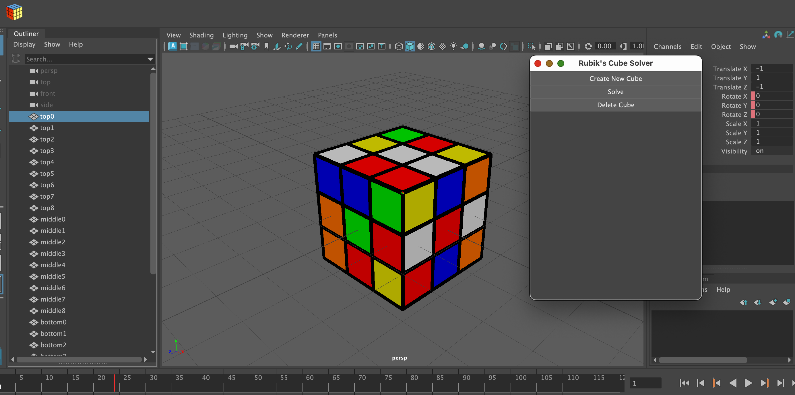

## MayaRubiks Python Plug-in



**[Video Demo Link](https://youtu.be/wKXn7nVkqU4)**

### Overview

A Maya plug-in that provides a comprehensive Rubik's Cube solving interface within Maya.

Given a scrambled cube, the plug-in applies the Kociemba algorithm (supported by muodov's kociemba
PyPi package) to create a full animation of the cube being solved step-by-step.

### Installation
Clone the git repository onto your local machine. Locate the correct `Maya.env` file for the Maya app and version you intend to use ([ref](https://help.autodesk.com/view/MAYAUL/2026/ENU/?guid=GUID-8EFB1AC1-ED7D-4099-9EEE-624097872C04)), and add the following line to the document:

```bash
MAYA_MODULE_PATH="Path/To/ClonedMayaRubiksRepoDirectory"
```

For detailed setup reference, refer to the [demo video](https://youtu.be/wKXn7nVkqU4)

### Usage
Locate the new `MayaRubiks` loadable plug-in within the Maya Plug-in Manager Window. Press `Load`.

Use the newly created `MayaRubiks` shelf and its attached interactive UI to create and solve rubik's cubes.
